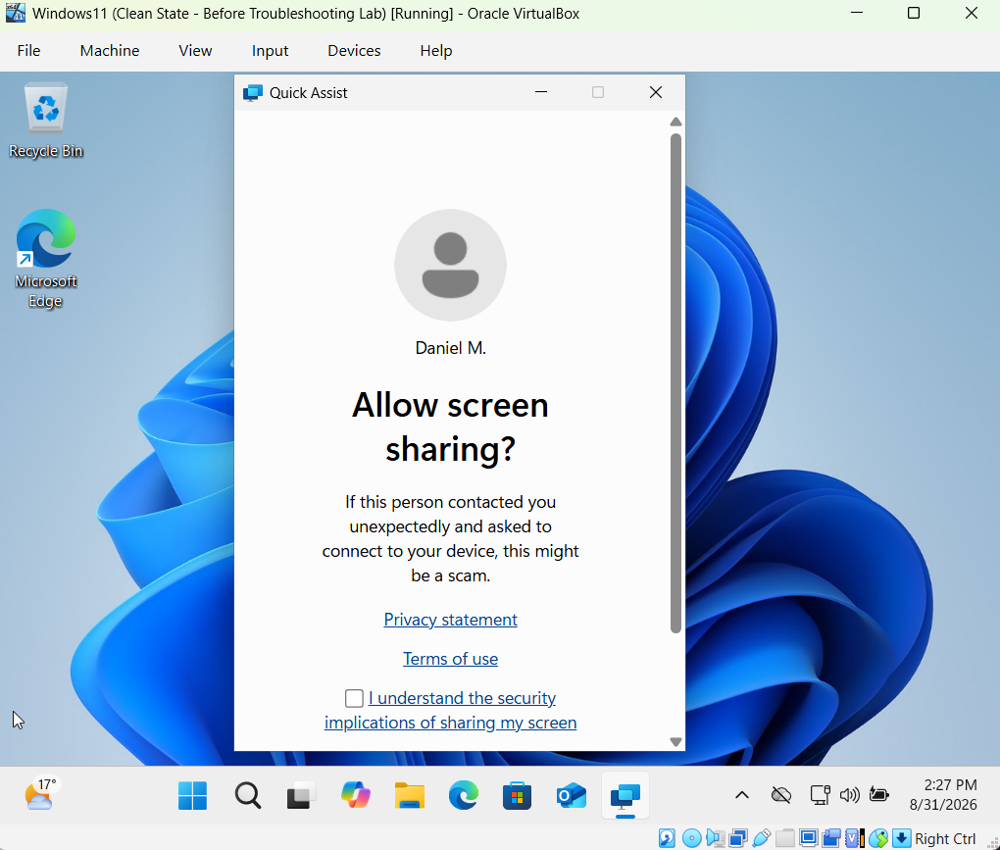
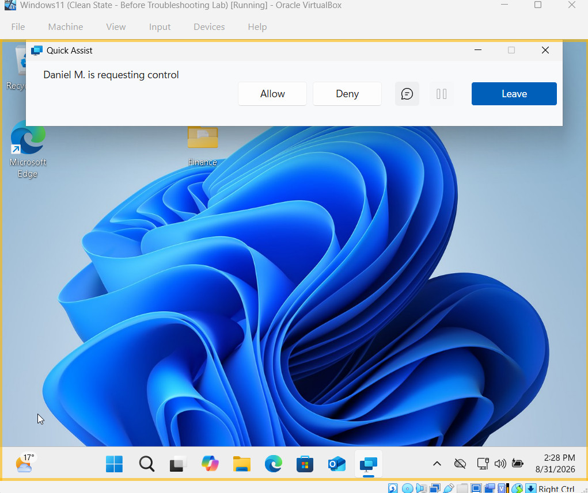
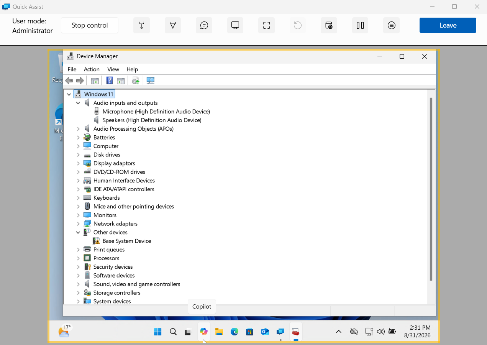
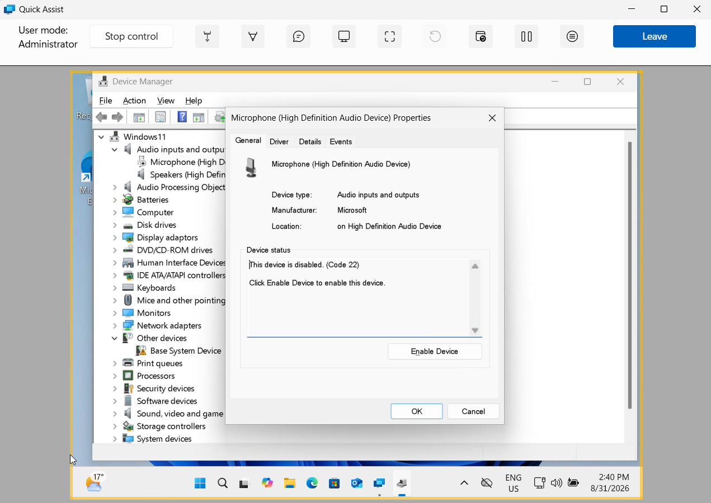
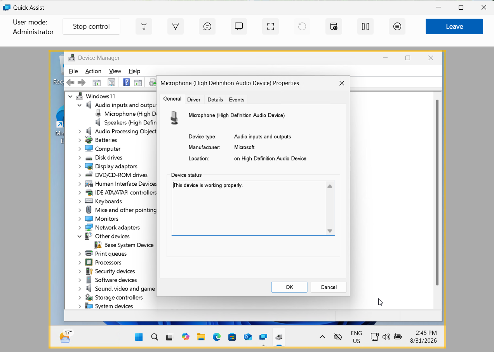

# Remote IT Support - Microsoft Quick Assist Lab

A practical remote IT support lab demonstrating how Microsoft Quick Assist can be used to establish an authorised remote-support session, diagnose a Windows 11 peripheral issue, apply a resolution and verify that the device is working correctly.

## Scenario

A Windows 11 user reports that their microphone is not working correctly.

The objective was to connect to the user's endpoint remotely, obtain appropriate consent, diagnose the microphone issue, restore the device and verify the resolution.

## Environment

- Windows 11 virtual machine
- Microsoft Quick Assist
- Oracle VirtualBox
- Windows Device Manager
- High Definition Audio Device
- Physical Windows laptop used as the support technician device

## Remote Support Connection

The support session was initiated using Microsoft Quick Assist.

The user was required to explicitly approve screen sharing before the technician could view the Windows 11 endpoint.

After screen sharing was approved, I requested remote control of the device.

The user was required to provide separate consent before remote control was granted.

This demonstrated a consent-based remote support workflow before any troubleshooting actions were performed.

## Initial Investigation

After receiving authorised remote control, I opened Device Manager on the Windows 11 endpoint through the Quick Assist session.

The system displayed both the microphone and speakers under **Audio inputs and outputs**.

I then investigated the microphone device properties to identify why the peripheral was not operating correctly.

## Root Cause

Device Manager reported:

`This device is disabled. (Code 22)`

This confirmed that the microphone problem was caused by the audio input device being disabled at the Windows device level.

## Resolution

While maintaining the remote Quick Assist session, I re-enabled the microphone through Device Manager.

No physical access to the Windows 11 endpoint was required.

## Verification

After re-enabling the device, I reopened the microphone properties in Device Manager.

Windows reported:

`This device is working properly.`

This confirmed that the peripheral issue had been resolved successfully through the remote-support session.

## Skills Demonstrated

- Microsoft Quick Assist remote support
- Consent-based screen sharing and remote control
- Windows 11 endpoint troubleshooting
- Peripheral and audio-device troubleshooting
- Windows Device Manager diagnostics
- Interpretation of Device Manager error Code 22
- Remote fault isolation and root-cause analysis
- Device restoration and verification
- Independent remote problem solving
- Technical incident documentation

## Project Context

This project was completed in a controlled lab environment using a Windows 11 virtual machine as the simulated end-user endpoint.

The issue was deliberately reproduced to practise a realistic remote first-line IT support workflow rather than representing an incident handled in a production organisation.
